# 02 - System Manager - Automação

Neste exemplo você irá criar seu próprio documento de automação e executar. Para mais informações sobre os documentos do system mananager: [clique aqui](https://docs.aws.amazon.com/systems-manager/latest/userguide/sysman-ssm-docs.html)

1. Abra novamente o serviço `System Manager`
2. No menu lateral esquerdo clique em `Documentos`. Esta na seção `Recursos Compartilhados`.
3. Na lateral direita superior clique em `Create Document` e clique em `Automation`
   
4. No canto esquerdo superior da tela coloque o nome `Associando-Funcao-Instancia-EC2`
    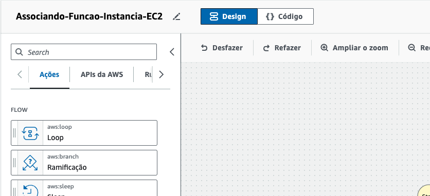
5. Em Atributos do documento, na lateral direita, adicione:
   1. Descrição do docuemnto abaixo:
      ``` markdown
      ---
      # Associando-Funcao-Instancia-EC2

      Essa automação lista todas as instancias EC2 rodando na região e adiciona uma função com permissões a conta AWS
      ```
   2. Perfil de admissão:  `LabRole`
    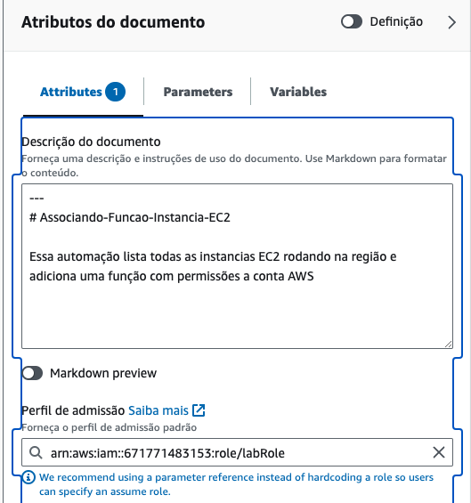
   3. Clique na aba de parâmetros e clique em `Adicionar um parâmetro`.
   4. Primeiro parametro de entrada:
      1. Nome do parâmetro: `instanceProfile`
      2. Tipo: String
      3. Necessário: Desmarque a caixa
      4. Valor Padrão: `LabInstanceProfile`
      5. Descrição: `Nome do perfil da instância para usar na(s) instância(s)`
    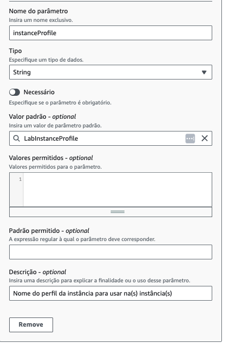
   5. Segundo parametro de entrada:
      1. Nome do parâmetro: `AutomationAssumeRole`
      2. Tipo: String
      3. Necessário: Marque a caixa
      4. Descrição: `O nome do recurso da Amazon (ARN) da função que permite que a Automação do SSM execute as ações em seu nome.`
    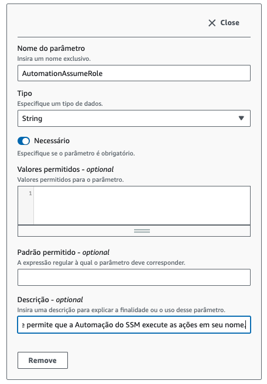
6. Na lateral esquerda tem as opções de integração, arraste a opção `Executar um script` para o fluxo. Preencha os campos com os seguintes detalhes:
   1. Nome da etapa: `AdicionandoFuncaoInstancias`
   2. Clique em entrada `Entradas`
   3. Runtime: Python3.8
   4. Handler: `associando_perfil_instancia`
   5. Script: 
```python
import boto3

import json
ec2 = boto3.client('ec2')
ec2_resource = boto3.resource('ec2')

def associando_perfil_instancia(event, context):
    print(f"event: {json.dumps(event)}")
    if(event.get("instanceProfile") is None):
        perfilDeInstancia = 'LabInstanceProfile'
    else:
        perfilDeInstancia = event["instanceProfile"]

    instancias = ec2_resource.instances.filter(
            Filters=[{'Name': 'instance-state-name', 'Values': ['running']}])
    retorno = dict()
    retorno["instanceProfile"] = list()

    for instancia in instancias:
        if(instancia.iam_instance_profile is None):
            ec2.associate_iam_instance_profile(
                IamInstanceProfile={
                    'Name': perfilDeInstancia
                },
                InstanceId=instancia.id
            )
            print(f"Perfil de instancia {perfilDeInstancia} associado a  {instancia.id} de maneira bem sucedida")
        else:
            print(f"Instancia {instancia.id} já tem uma funcao associada: {instancia.iam_instance_profile['Arn']}")
            retorno["instanceProfile"].append(instancia.id)
    return retorno
```


   1. Entrada adicional:
      1. Nome da entrada: InputPayload
      2. Valor entrada: `instanceProfile: '{{instanceProfile}}'`


7. Confira se está tudo de acordo e clique em `Criar runbook`
8. Você estará de volta página de documentos, clique na aba `Da minha propriedade` e verá seu documento recém criado. Clique no nome dele.
   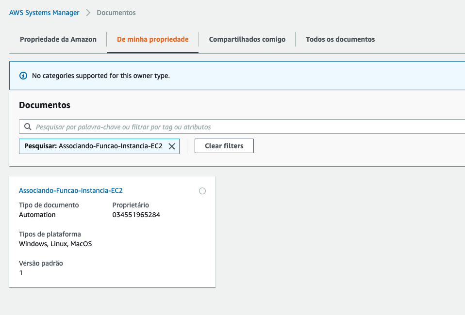
9.  No lado direito superior clique em `Executar automação`
    
10. Na variável `AutomationAssumeRole` escolha `LabRole`
    
11. Clique em executar.
12. Na página que abre vera a unica etapa dessa automação em andamento
    
13. Quando a execução for bem sucedida a página ficará como na imagem, mostrando o status de êxito.
    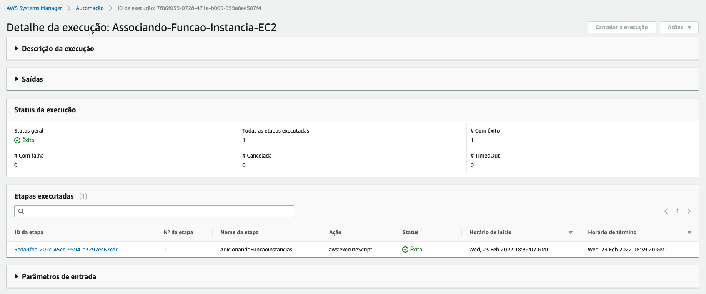
14. Para confirmar que funcionou vá ao [console de ec2](https://console.aws.amazon.com/ec2/v2/home?region=us-east-1#Instances:v=3) e selecione uma instância EC2 e vá na aba segurança dela para confirmar que a Função do IAM esta como `LabRole`
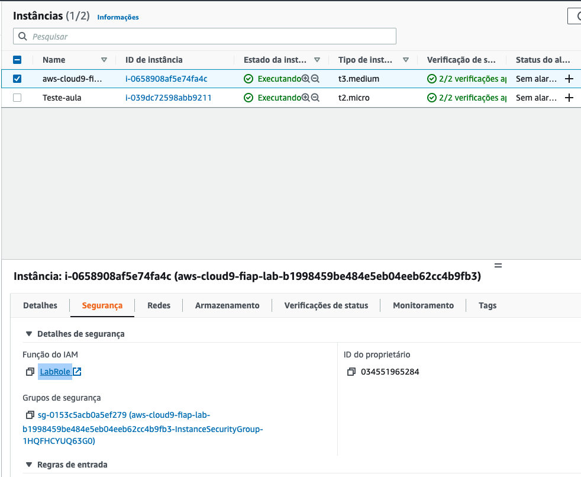
15.  Agora vamos criar uma nova versão da automação com mais uma etapa e com informações da saida da primeira etapa entrando na segunda etapa. Para isso volte ao [console de listagem de documentos](https://console.aws.amazon.com/systems-manager/documents/?region=us-east-1). Clique em `De minha propriedade` e abra o documento criado por você.
16.  No canto direito superior clique em `Ações` e `Criar nova versão`
    
17. Vá até `Etapa 1: AdicionandoFuncaoInstancias` e edite as saídas para o seguinte:
    1. Nome: `instanceProfiles`
    2. Selector: `$.Payload`
    3. Tipo: StringMap
18. Na aba Configuração, edite a `Próxima etapa` coloque o valor: `Adicionar nova etapa`
19. Arraste a opção `Executar um script` para o fluxo.
20. Adicione os seguintes detalhes:
    1. Nome da etapa: `recebe_saida_etapa_1`
    2. Tipo de ação: Executar um script
    3. Runtime: Python3.8
    4. Handler: `script_handler`
    5. Script:
    ```python
    import json

    def script_handler(events, context):
        print(json.dumps(events))
    ```

    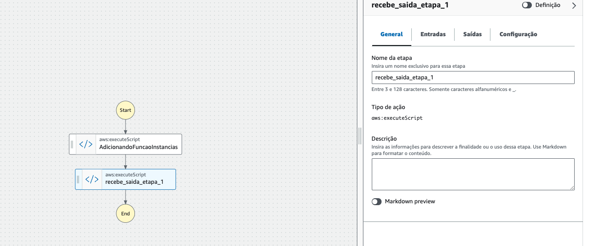
    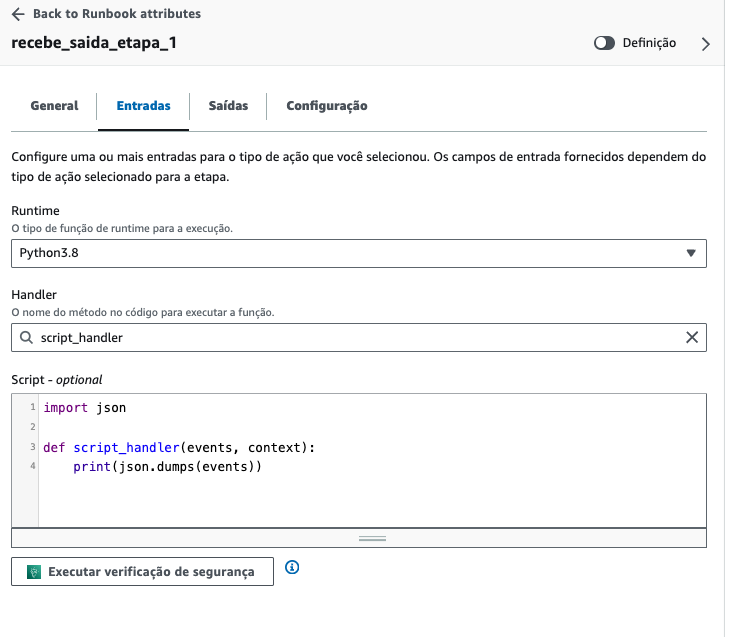

    6. Entradas adicionais: 
       1. Nome da entrada: InputPayload
       2. Valor de entrada: `instanceProfile: '{{ AdicionandoFuncaoInstancias.instanceProfiles}}'`
    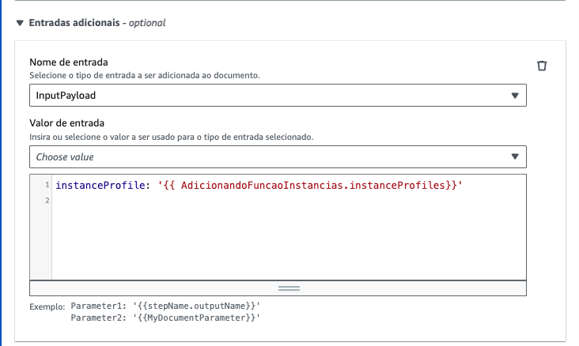
21. Clique em em `Criar nova versão` e selecione a opção `Definir nova versão como padrão` ao final da página.
    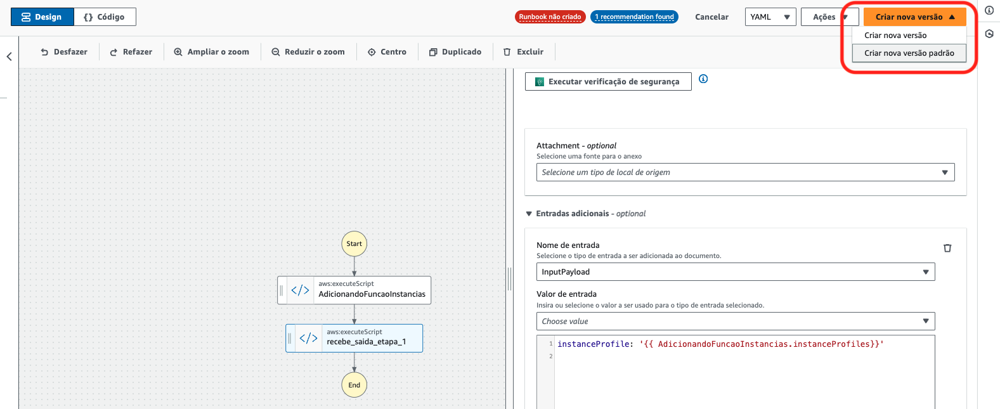
22. Execute novamente sua automação como feito nos passos anteriores. Irá notar que agora esta na versão 2 pela descrição da versão do documento.
  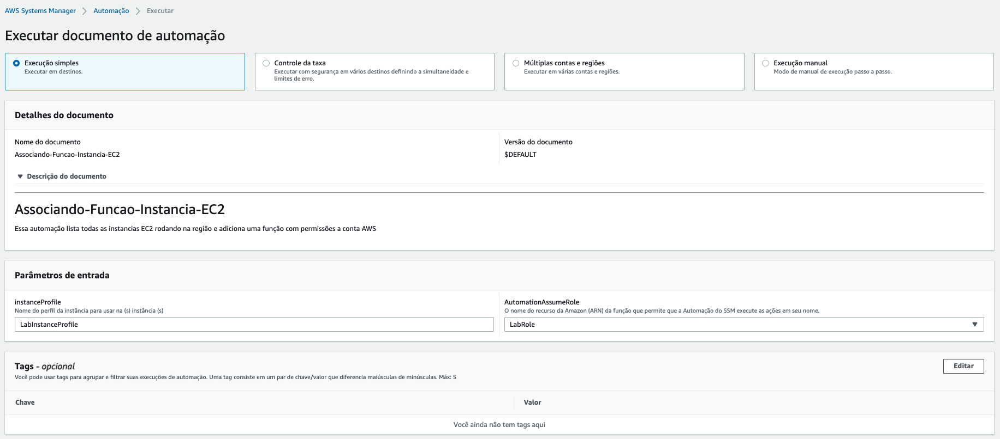
  
23.  O código da etapa 2 era apenas para fazer um print do evento que recebe e nesse evento deve constar a saida da etapa 1 que foi configurada como entrada na etapa 2. Para conferir, clique no ID da etapa 2 e verá que no log tem uma lista `instanceProfile`.

